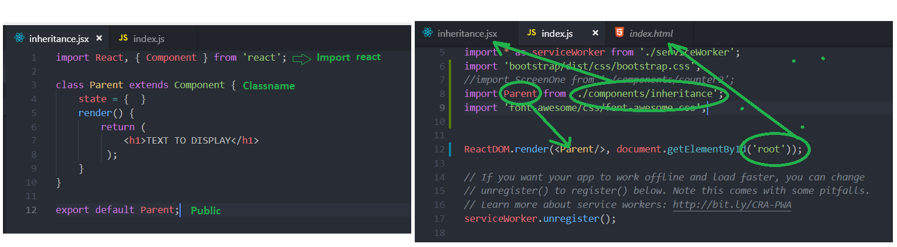

# React Basics by examples

>Code snippets explaining the basic react concepts.

## utilities:
- visual studio code
- live html previewer ( vsc extension)
- One Dark pro (vsc extension)
- Prettier (vsc extension)
- Debugger for chrome (vsc extension)
- Simple react snippets (vsc extension)
- lodash (vsc extension)

# 1)Create React Component

>setup basic component and display content in browser

setup react from command shell  :

```sh
create-react-app my-react-app

```

Simple react snippet :

```sh
imrc = import statement
cc = create react class
```
run react page (start terminal in vsc : Crtl + '):

```sh
npm start
```


# 2) React Component Basic layout:

> essential concepts.
-import: reference to react.
-Class: component container. CLASSNAME MUST START WITH CAPITAL !!
- state: data
- render: view 
- functions: logic
- export: public



create Basic.jsx in src/components folder:

```sh
import React, { Component } from 'react'; //import react = reference react = using statement in C# 

class Basics extends Component { // class definition - COMPONENT NAME MUST START WITH CAPITAL LETTER
    state = {  // STATE:  define initial state of the component = data
        count : 15, //  value        
        stringstatement : 'simple test string', //string
        tags: [1,2,3,4,5] // array
     }


     styles =  {  // css definition.. => class 
        fontWeight : "bold",
        fontSize : 30 ,
        color: 'red'       
    };
     renderTags() // LOGIC : function => can be condition
    {
        if (this.state.tags.length === 0 ) return <p style={this.styles}>there are no tags</p>
   
        else
        { //map => loop through array and display elements
            return <ul>{this.state.tags.map(tag => <li key={tag}>{tag}</li>)}</ul>
        
        }
    }
    render() {  // VIEW:
        return ( //          

        <div> 
            <p style={this.styles}>{this.state.stringstatement + "  & inline text string create react statement" }</p>
            <h2>{this.state.count}</h2>
            <h3>{this.renderTags()}</h3>
          </div>
          );
            // multiple statements need to be wrapped in div
            // render = can contain html + css + variables + eventlisteners (onClick) 
            // variables = reference by this. = current class (object)

    }
}
 
export default Basics; // makes the class pulbic => accessible 
```

# 2) Inheritance 

A few motivating and useful examples of how your product can be used. Spice this up with code blocks and potentially more screenshots.

_For more examples and usage, please refer to the [Wiki][wiki]._

