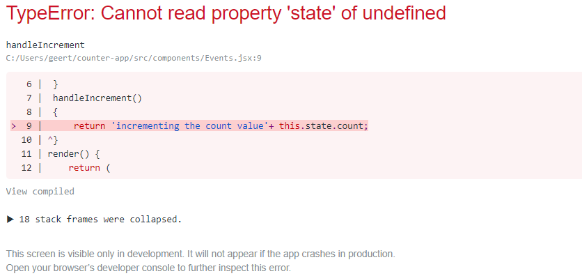
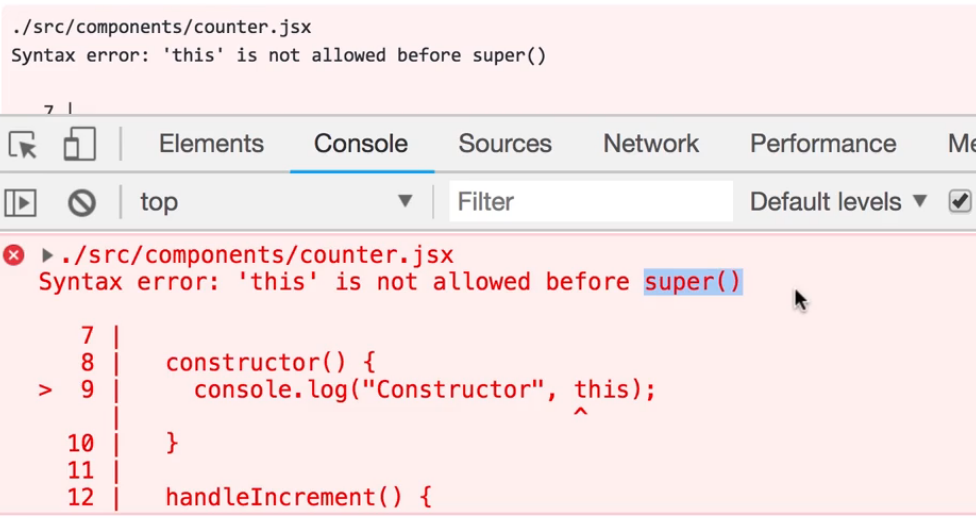
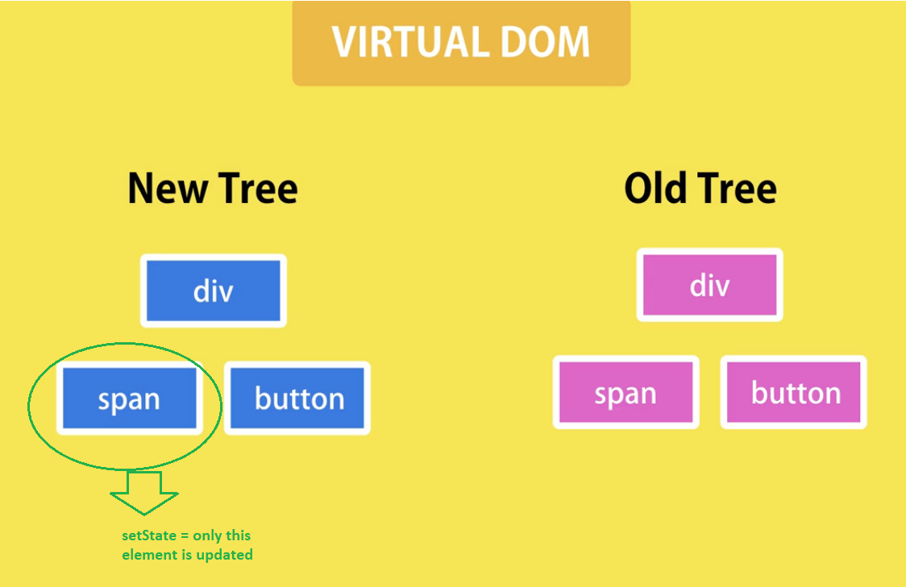

# React events by example
> event listening and handling with React
## Event listener:
1. button + onClick event 
2. reference to the eventhandler = handleIncrement. Not a direct call
## Event handler:
> this called by a reference to a function causes an error. this. refers to the global object. = window object


## 1. Default binding example:
```sh

function display(){
 console.log(this); // 'this' will point to the global object
}
display(); 
```
This is a plain function call. The value of this inside the display() method in this case is the window — or the global — object in non-strict mode. In strict mode, the this value is undefined.

## 2. Implicit binding:

```sh
var obj = {
 name: 'Saurabh',
 display: function(){
   console.log(this.name); // 'this' points to obj
  }
};
obj.display(); // Saurabh 

```
When we call a function in this manner — preceded by a context object — the this value inside display() is set to obj.

But when we assign this function reference to some other variable and invoke the function using this new function reference, we get a different value of this inside display() .

```sh
var name = "uh oh! global";
var outerDisplay = obj.display;
outerDisplay(); // uh oh! global
```

In the above example, when we call outerDisplay(), we don’t specify a context object. It is a plain function call without an owner object. In this case, the value of this inside display() falls back to default binding. It points to the global object or undefined if the function being invoked uses strict mode.

This is especially applicable while passing such functions as callbacks to another custom function, a third-party library function, or a built-in JavaScript function like setTimeout .

Consider the setTimeout dummy definition as shown below, and then invoke it.

```sh
// A dummy implementation of setTimeout
function setTimeout(callback, delay){
   //wait for 'delay' milliseconds
   callback();
}
setTimeout( obj.display, 1000 );
```
We can figure out that when we call setTimeout, JavaScript internally assigns obj.display to its argument callback .
```sh
callback = obj.display;
```
This assignment operation, as we have seen before, causes the display() function to lose its context. When this callback is eventually invoked inside setTimeout, the this value inside display() falls back to default binding.
```sh
var name = "uh oh! global";
setTimeout( obj.display, 1000 );
// uh oh! global
```
## 3. Solution: Explicit hard binding:

To avoid this, we can explicitly hard bind the this value to a function by using the bind() method.
```sh
var name = "uh oh! global";
obj.display = obj.display.bind(obj); 
var outerDisplay = obj.display;
outerDisplay();
// Saurabh
```

Now, when we call outerDisplay(), the value of this points to obj inside display() .
Even if we pass obj.display as a callback, the this value inside display() will correctly point to obj .
Even handler acts as a stand alone function. "this" makes reference to window object. Therefore this.state.count => undefined>  

```sh
constructor() //method called when object Events is created
    {
        super();//
        this.handleIncrement = this.handleIncrement.bind(this); // binding of this to current object = Class 
       
    }
```

Explicit hard binding must happen in the constructor. The constructor must be superceded by the super() method if not 
it generates an error. super() references the constructor 




## 4. setState: updating the state:

```sh
this.setState({count:this.state.count++} ); 
```

The state is updated by calling the this.setState() method. (this = current object = class)



```sh
import React, { Component } from 'react';

class Events extends Component {
    constructor() //method called when object Events is created
    {
        super();//
        this.handleIncrement = this.handleIncrement.bind(this); // binding of this to current object = Class 
       
    }
    state = { 
        count:0
     }
     handleIncrement() // event handler.
     {  
         this.setState({count:this.state.count++} ); 
         // this refers now to the current object
         // this is binded to the currenct object in the constructor 
        //  this.handleIncrement = this.handleIncrement.bind(this);
     }
    render() { 
        return (
            <div>
                <span>{}</span>
                <button
                onClick={this.handleIncrement} className='btn btn-secondary btn-sm'
                >increment</button>
            </div>


          );
    }


}
 
export default Events;
```


