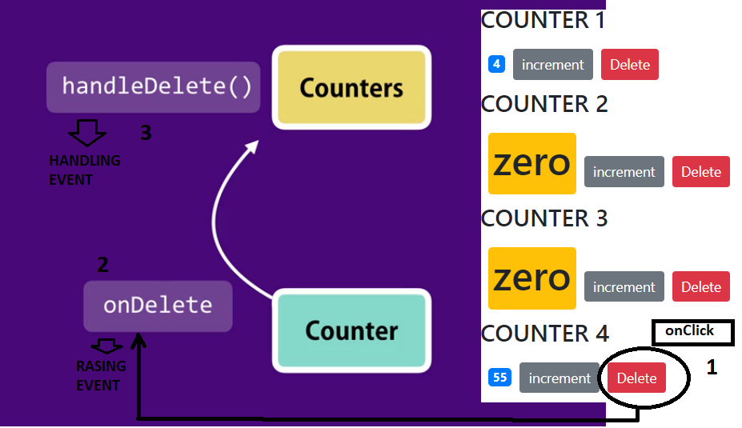

# React raising and handlings Events by example
> the component that owns a priece of the state should, be the one modifying it.
## The Counters component contains the data (owns the data in the state):
1. state data = private/local scope not visble outside the component.
2. handling the event = processing the data (changing the state from within the (Counters)component)
3. raising the event = firing the event after an action = onClick button.




## 1. button click triggers the onClick event 
-button click, 'onClick',  raises the onDelete event  (counter.jsx)
## 2. Raising the event 
- the onClick event generates a the onDelete Prop, which is passed to the parent component (counters.jsx)

```sh
render() { 
      

        return (
            <div>
            {this.props.children}
                <span className={this.getBagdeClasses()}>{this.formatCount()}</span>
                <button
                onClick={this.handleIncrement} className='btn btn-secondary btn-sm'
                >increment</button>
                <button  onClick={this.props.onDelete} className='btn btn-danger btn-sm m-2'>Delete</button>
            </div>


          );

```


## 3. Handeling the event :

- The onDelete event is passed via props to the Counters.jsx component
- The activation of the onDelete event, triggers the handleDelete handler.  


```sh
import Counter from './counter';

class Counters extends Component {
    state = {
        counters:
        [
            {id:1,value:4},
            {id:2,value:3},
            {id:3,value:6},
            {id:4,value:55},
        
        ]  

        };

        handleDelete = (counterId) => {
            console.log('delete is being handled' , counterId);
        }

    render() { 

        console.log('props', this.props);
       
        return (
            <div>        
              
          {this.state.counters.map(counter => (<Counter key={counter.id} onDelete={this.handleDelete} id={counter.id} value={counter.value}  selected={true}>
          <h4>COUNTER {counter.id}</h4>
          </Counter>))}
               
           
            </div>
          );
    }
}
 
export default Counters;
  handleDelete() // HAN
        {
            console.log('delete is being handled');
        }

    render() { 
        console.log(this.props);
        return (
            <div>         
              
          {this.state.counters.map(counter => (<Counter key="{counter.id}" onDelete={this.handleDelete} value={counter.value}>
          <h4>COUNTER {counter.id}</h4>
          </Counter>))}
               
           
            </div>
          );

```

 Props make react component reusable. The same principle is used when creating functions we create a function with parameters so we can pass them different arguments every time and get different results.

 >The value of props can only be changed in the state. => see handleIncrement => this.setState({count:this.state.count + 1} ); 

## 3. counter example:

```sh
import React, { Component } from 'react';

class Counter extends Component {
    constructor() //method called when object Events is created
    {
        super();//binds the constructor to 
        this.handleIncrement = this.handleIncrement.bind(this); //explicit hard binding = to current class 
       
    }
    state = { 
        value: 0
        
     }
     handleIncrement() // event handler.
     {  
         this.setState({value:this.state.value + 1} ); 
         // this refers now to the current object
         // this is binded to the currenct object in the constructor 
        //  this.handleIncrement = this.handleIncrement.bind(this);
     }
    render() { 
       // console.log('props', this.props);

        return (
            <div>
                <span className={this.getBagdeClasses()}>{this.formatCount()}</span>
                <button onClick={this.handleIncrement} className='btn btn-secondary btn-sm'>increment</button>
               <button 
                onClick={() => this.props.onDelete(this.props.id)} 
                className='btn btn-danger btn-sm m-2'>
                Delete
                </button>
            </div>


          );
    }
    formatCount()
    { 

        const{value} = this.state;
        return value === 0 ? <h1>zero</h1> :value; 

    }
    getBagdeClasses() {
        let classes = 'badge m-2 badge-';
        classes += (this.state.value === 0) ? 'warning' : "primary";
        return classes;
    }


}
 
export default Counter;
```
