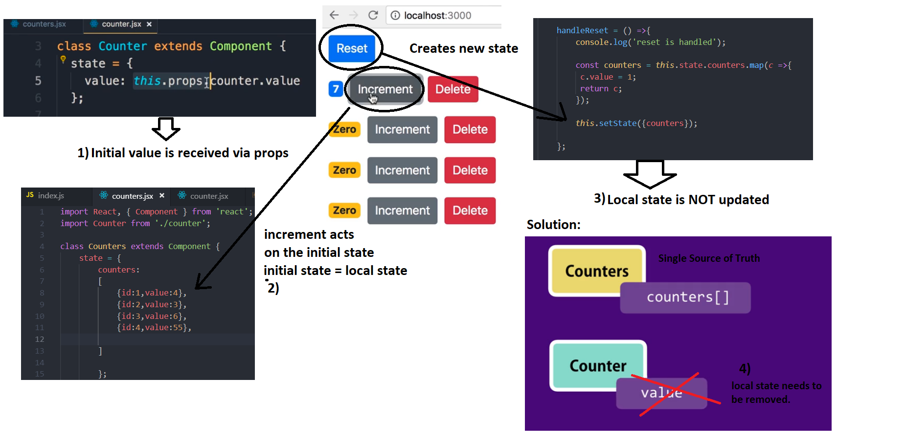
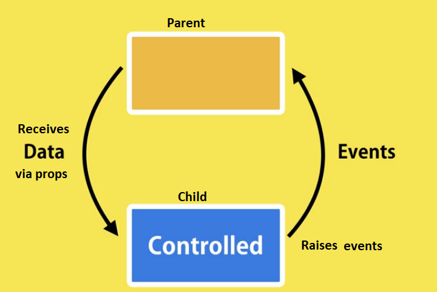

# React Removing the local state by example
- components need 'a single source of truth'  = THEN NEED TO REACT ONLY TO STATE EVENTS 
- local state listens to local events. 


# 1. Single source of truth:
 Only one place which represents state of application, and your UI listens to it.
    - initial state
    - setState(newState) 

# initial state:
 ```sh
//a) initial state:
state = {
        counters:
        [
            {id:1,value:4},
            {id:2,value:0},
            {id:3,value:0},
            {id:4,value:0},
          
        ]  

        };

        ```


b) changed state:

  handleIncrement = counter =>  {
            console.log('handeling the increment');
            const counters = [...this.state.counters];
            const index = counters.indexOf(counter);
            counters[index] = {...counter};
            counters[index].value++;
            this.setState({counters});
            console.log(this.state.counters[0]);
        };
 ``` 


# 2.Local state problem:
1. The initial value is received via props
2. increment buttons works with initial state (this works)
3. Reset creates a new state => does not work !
4. Remove local state & migrate to single source of truth



# 3. :  controlled components
> controlled componentes only respond to the state. (exclude local events)
- remove state in the child component = counter 
- controlled component = child component which doesnt have local state
- controlled componente receive data via  via props.
- controlled components raises events and pass them to their parent



```sh

import Counter from './counter';

class Counters extends Component {
    state = {
        counters:
        [
            {id:1,value:4},
            {id:2,value:3},
            {id:3,value:6},
            {id:4,value:55}
        
        ]  

        };

        handleDelete = (counterId) => { //id parameter (props)
            console.log('delete is being handled' , counterId);
            const counters = this.state.counters.filter( c => c.id !== counterId);
             // A new state is based on the props (id)
            this.setState({counters: counters}); // rendering of the new state. => updating. 
        }

    render() { 

        console.log('props', this.props);
       
        return (
            <div>        
              
          {this.state.counters.map(counter => (<Counter key={counter.id} onDelete={this.handleDelete} id={counter.id} value={counter.value}  selected={true}>
          <h4>COUNTER {counter.id}</h4>
          </Counter>))}
               
           
            </div>
          );
    }
}
 
export default Counters;
 
```

# 4. Avoid hardcoding fields by using generic props (encapsulation principle) :

- Using hardcoded fields like value={counter.value} & id={counter.id} need to be udated when changed
- generic counter={counter} encapsulates all fields. We reference  specific fields when necessary. 

```sh

import React, { Component } from 'react';
import Counter from './counter';

class Counters extends Component {
    state = {
        counters:
        [
            {id:1,value:4},
            {id:2,value:0},
            {id:3,value:0},
            {id:4,value:0},
          
        ]  

        };

        handleReset = () =>{
            console.log('reset is handled');

            const counters = this.state.counters.map(c =>{
             c.value = 1;
             return c;
            });

            this.setState({counters});

        };

        handleIncrement = counter =>  {
            console.log('handeling the increment');
            const counters = [...this.state.counters];
            const index = counters.indexOf(counter);
            counters[index] = {...counter};
            counters[index].value++;
            this.setState({counters});
            console.log(this.state.counters[0]);
        };

        handleDelete = (counterId) => { //id parameter (props)
            console.log('delete is being handled' , counterId);
            const counters = this.state.counters.filter( c => c.id !== counterId); // A new state is based on the props (id)
            this.setState({counters: counters}); // rendering of the new state. => updating. 
        };

    render() { 

        console.log('props', this.props);
       
        return (
            <div>        
              <button onClick={this.handleReset} className='btn btn-primary btn-sm m-2'> Reset</button>

          {this.state.counters.map(counter => (<Counter key={counter.id}
           onDelete={this.handleDelete} 
           onIncrement={this.handleIncrement}
          counter={counter}>
          <h4>COUNTER {counter.id}</h4>
          </Counter>))}
               
           
            </div>
          );
    }
}
 
export default Counters;
```

- references need to include the counter (prop)  onClick={() => this.props.onDelete(this.props.counter.id)} 
- previous :  onClick={() => this.props.onDelete(this.props.id)} 

```sh
import React, { Component } from 'react';

class Counter extends Component {
    constructor(props) //method called when object Events is created
    {
        super(props);//access the constructor of the parent class = counters constructor  
        this.handleIncrement = this.handleIncrement.bind(this); //explicit hard binding = to current class 
       
    }
   
    render() { 
       // console.log('props', this.props);

        return (
            <div>
                <span className={this.getBagdeClasses()}>{this.formatCount()}</span>
                <button onClick={this.handleIncrement} className='btn btn-secondary btn-sm'>increment</button>
               <button 
                onClick={() => this.props.onDelete(this.props.counter.id)} //reference the counter counter={counter} object set in counters
                className='btn btn-danger btn-sm m-2'>
                Delete
                </button>
            </div>


          );
    }
    formatCount()
    { 

        const{value} = this.state;
        return value === 0 ? <h1>zero</h1> :value; 

    }
    getBagdeClasses() {
        let classes = 'badge m-2 badge-';
        classes += (this.state.value === 0) ? 'warning' : "primary";
        return classes;
    }


}
 
export default Counter;

```
   

 
