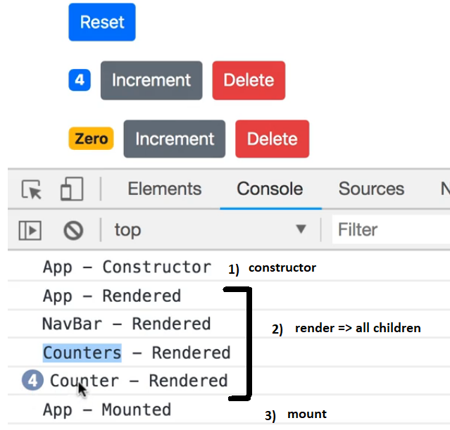

# React Mount lifecycle hooks by example
> lifcycle hooks are defining methods in the components life cycle. 




# 1. Constructor:
is called only once, when the instance of the class is instantiated.
- set stated based on props received from outside (the component)
- state is set directly:

```sh

 constructor(props)
 {
     super(props); // constructor of base class
     this.state = this.props.something; 
 }
```
- props must be passed to the constructor(props) and constructor of the base class => super(props);


# 2. componentDidMount :
is called right after the component is renderd in the DOM
- the ideal method for an Ajax call in order to get data from the server

```sh
componentDidMount()
{  
    //Ajax call => get data from server
    this.setState() = 
}

```

# 3. render :
rendering the component in the DOM
- see other code


