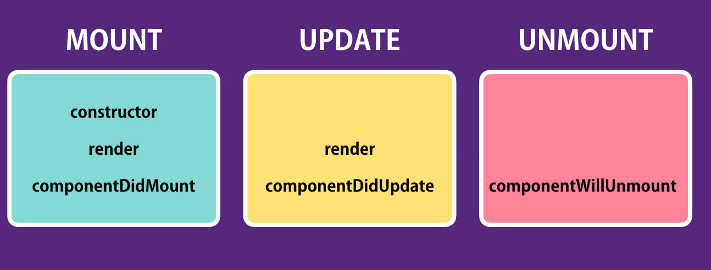

# React Update lifecycle hooks by example
> lifcycle hooks are defining methods in the components life cycle. 


# 1. componnentWillUnmount:
- the method is called just BEFORE component is removed from the DOM. 
- The virtual DOM will be compared with old virtual DOM
- The change will be updated. Nothing else will be affected


is called only once, when the instance of the class is instantiated.
- set stated based on props received from outside (the component)
- state is set directly:

```sh

 constructor(props)
 {
     super(props); // constructor of base class
     this.state = this.props.something; 
 }
```
- props must be passed to the constructor(props) and constructor of the base class => super(props);


# 2. componentDidUpdate :
- the ideal method for an Ajax request to get updated data from the server
- compare the actual state to the previous state
- compare the actual props to the previous props


