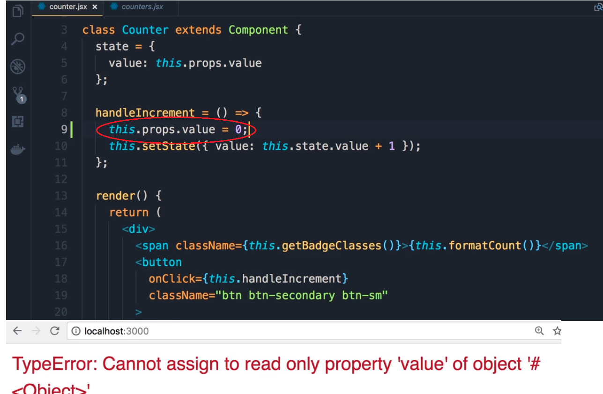

# React props by example
> props ase passed as an argument of functions.
## Difference between props and state:
1. state = variables with local private/scope = other components cannot acces state.
2. props =  passing arguments to a function = global scope  (read-only)

> props enable data exchange between components
> we cannot change propts inside the component. (encapsulation principle) 


## 1. props example :
```sh
class DummyComponent extends React.Component {
  render() {
    return <div>Hello {this.props.name}</div>;
  }
  
}
// when using the component
<DummyComponent name="Manoj" />
<DummyComponent name="Ajay" />


const DummyFunction = (name) => {
  console.log(`Hey ${name}`)
}
DummyFunction('Manoj');
DummyFunction('Ajay');

```
> Changing the value of props gives a readonly error:



## 2. state example :

```sh

class DummyComponent extends React.Component {
  state = {
    name: 'Manoj'
  }
  render() {
    return <div>Hello {this.state.name}</div>;
  }
  
}
const DummyFunction = () => {
  let name = 'Manoj';
  console.log(`Hey ${name}`)
}

```

 Props make react component reusable. The same principle is used when creating functions we create a function with parameters so we can pass them different arguments every time and get different results.

 >The value of props can only be changed in the state. => see handleIncrement => this.setState({count:this.state.count + 1} ); 

## 3. counter example:

```sh
import React, { Component } from 'react';

class Counter extends Component {
    // constructor() //method called when object Events is created
    // {
    //     super();//binds the constructor to 
    //     this.handleIncrement = this.handleIncrement.bind(this); //explicit hard binding = to current class 
       
    // }
    state = { 
        count: this.props.value
        
     }
     handleIncrement() // event handler.
     {  
         this.setState({count:this.state.count + 1} ); 
         // this refers now to the current object
         // this is binded to the currenct object in the constructor 
        //  this.handleIncrement = this.handleIncrement.bind(this);
     }
    render() { 
        console.log('props', this.props);

        return (
            <div>
            {this.props.children}
                <span className={this.getBagdeClasses()}>{this.formatCount()}</span>
                <button
                onClick={this.handleIncrement} className='btn btn-secondary btn-sm'
                >increment</button>
            </div>


          );
    }
    formatCount()
    { 

        const{count} = this.state;
        return count === 0 ? <h1>zero</h1> :count; 

    }
    getBagdeClasses() {
        let classes = 'badge m-2 badge-';
        classes += (this.state.count === 0) ? 'warning' : "primary";
        return classes;
    }


}
 
export default Counter;
```
