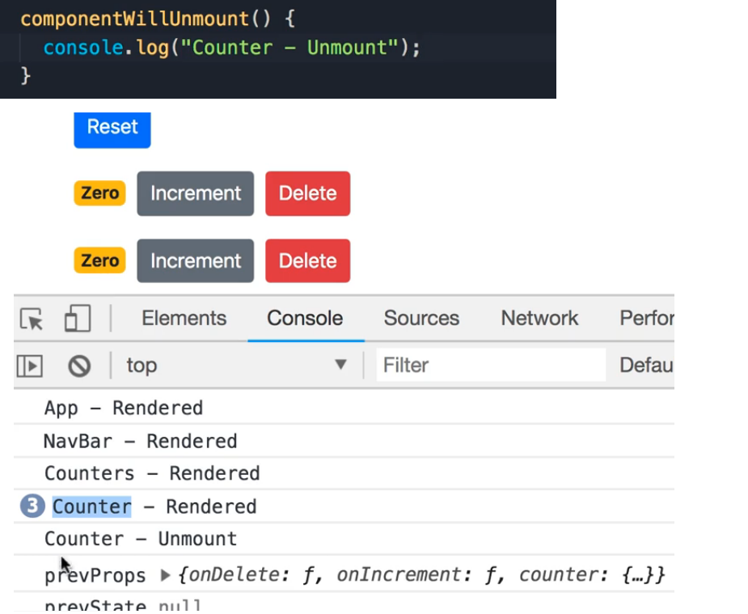

# React ummount lifecycle hooks by example
> lifcycle hooks are defining methods in the components life cycle. 

# 1. componentWillUnmount:
- method before component will be removed from the DOM
- At this point components can be cleand up, to avoid memory leaks. 

