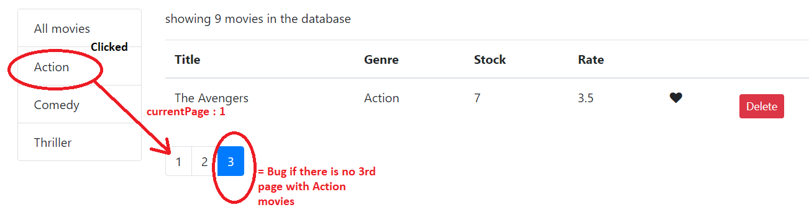

# React by example: Add sorting

> Sort the grid by its column headers   

## Previous steps:
1. [Load data](./ConnectToData.md)
2. [File structure](./filestructure.md)
3. [Display array in Grid](./displayGrid.md)
4. [Delete row button](./deletrow.md)
5. [Add checkbox - like button](./AddLike.md)
6. [Add pagination ](./Paginate.md)
7. [Add type checking ](./typechecking.md)
8. [Add Filtering ](./Listgroup.md)

# 1. Create listgroup:

- create listgroup page: listgroup.jsx
- imrc + sfc (react snippets) 

```sh
import React, { Component } from 'react';

const Listgroup = props => {
    return (  
<ul className="list-group">
  <li className="list-group-item">All</li> 
 </ul>
    );
}
 
export default Listgroup;

```
-reference listgroup in movies.jsx

```sh
import React, { Component } from 'react';
import {getMovies} from '../data/fakeMovieService';
import Like from './common/like';
import Pagination from './common/pagination';
import {paginate} from '../utils/paginate';
import PropTypes from 'prop-types';
import Listgroup from  './common/pagination';


```
# 2. Refactor layout:
- listgroup needs to be displayed to the left of the grid
- to achieve this the layout needs to be refactored
- create row with 2 columns:
    - left row: listgroup
    - right row: grid

```sh
<div className="row">
        <div className="col-2">
        <Listgroup></Listgroup>
        </div>
        <div className="col">
        <p>showing {count} movies in the database</p>
        <table className="table">
            <thead>
                <tr> 
 
``` 
# 3. Get listgroup data:

-get the listgroup data from local file
- importa getGenres into movies.jsx


```sh
import {getGenres} from '../data/fakeGenreService';
 
``` 
- incorporate getGenre() into state
- initiate the state of genre and movies to an empty array = [];


```sh
class Movies extends Component {
    state = { 
        movies :[],
        currentPage:1,
        genres:[],
        pageSize: 4      
           };
 
``` 

- use componentDidMount() (see lifecycle )to load the data:
    - getMovies();
    - getGenres();


```sh
componentDidMount()
           {
               const genres =[getGenres()];
               this.setState({movies:getMovies(),genres});
           }
 
```
# 3. Display listgroup:

 - the listgroup data is loaded from the local file in the componentDidMount() into the state by setState() method.
 - the listgroup (in movies.jsx) receives the data =  items={this.state.genres} and converts it to the props items.


```sh

 return ( 
        <div className="row">
        <div className="col-2">
    
        <Listgroup
         items={this.state.genres}       
          </Listgroup>

        </div>
        <div className="col">
``` 
- the listgroup data is then passed on via props in Listgroup.jsx 
- the data received in array format in through the props is displayed using the array.map method:
    - set key:  key={item._id} 
    - genre name: {item.name}


```sh

 const Listgroup = props => {

    const {items, onItemSelect,selectedItem} = props;

    return <ul className="list-group">
 
 {items.map(item => <li 
 key={item._id} 
 className={ "list-group-item"}
 > 
 {item.name}</li> )}
    </ul>

}
 
export default Listgroup;
``` 
# 4. Click event:

 -  the click event raises the following events: 
     1. the current active element of the listgroup
     2. filters the movie list
     3. alters the number of movies in the list 


- the onClick event raises the onItemSelect() event 
- the item which is clicked is passed as a props
- event bubbeling: 
    1. onClick
    2. onItemSelect() listgroup.jsx => movies.jsx
    3. handleGenreSelect => movies.jsx

```sh


const Listgroup = props => {

    const {items, onItemSelect,selectedItem} = props;

    return <ul className="list-group">
 
 {items.map(item => <li 
 onClick={() => onItemSelect(item)}
 key={item._id} 
 style={{cursor:'pointer'}}
 className={ item === selectedItem?"list-group-item active":"list-group-item"}
 > 
 {item.name}</li> )}
    </ul>

}
 
export default Listgroup;

}

```
 - onItemSelect() is raised in the movies.jsx
 - the event is handled in handleGenreSelect function
 - the 
 ```sh
 <Listgroup
         items={this.state.genres}
         selectedItem={this.state.selectedGenre}
         onItemSelect={this.handleGenreSelect}>
          </Listgroup>
 ```

- the selectedGenre property is created. => the genre which is clicked
- the state is update via setState() => the clicked genre is allocate to the new property selectedGenre
- the current page is set to 1 => this is necessary to avoid that whe
 ```sh
 handleGenreSelect = genre => {
            console.log(genre); //the clicked genre is passed as props
              this.setState({selectedGenre:genre, currentPage:1});
           };

```



# 5. Update the grid component:

 -  the click event updates the grid and sets the clicked action as a filter
     1. the grid needs to be updated
     2. the pagination needs to be updated
     3. the listgroup needs to be updated

 - updating of components happens within the render() method. 
 - 1. object destructuring >  const {pageSize,currentPage,selectedGenre,movies:allMovies} = this.state;
 - 2. array movies is converted to allMovies
 - 3. array.filter() => used to filter the allMovies
 - 4. filter =  m.genre._id === selectedGenre._id
 - 5. truthy  const filtered = selectedGenre && selectedGenre._id 
 - 6. pagination is set to filterd 
  
```sh
 render() {  
        const {length:count} = this.state.movies; 
        const {pageSize,currentPage,selectedGenre,movies:allMovies} = this.state; //1 + 2
  
        if(count === 0)return <p> "there are no movies in the database"</p>

        const filtered = selectedGenre && selectedGenre._id //5 
        ? allMovies.filter(m => m.genre._id === selectedGenre._id)  //3 + 4 
        : allMovies;

        const movies = paginate(filtered,currentPage,pageSize);
}

```

 - the listgroup is set dynamically (inline) to the selectedItem in the listgroup.jsx: 

 ```sh
   className={ item === selectedItem?"list-group-item active":"list-group-item"}
   ```

# 5. Full code :
 > listgroup.jsx

```sh
import React, { Component } from 'react';

const Listgroup = props => {

    const {items, onItemSelect,selectedItem} = props;

    return <ul className="list-group">
 
 {items.map(item => <li 
 onClick={() => onItemSelect(item)}
 key={item._id} 
 style={{cursor:'pointer'}}
 className={ item === selectedItem?"list-group-item active":"list-group-item"}
 > 
 {item.name}</li> )}
    </ul>

}
 
export default Listgroup;

```

> movies.jsx

```sh
import React, { Component } from 'react';
import {getMovies} from '../data/fakeMovieService';
import Like from './common/like';
import Pagination from './common/pagination';
import {paginate} from '../utils/paginate';
import PropTypes from 'prop-types';
import Listgroup from  './common/listgroup';
import {getGenres} from '../data/fakeGenreService';

class Movies extends Component {
    state = { 
        movies :[],
        currentPage:1,
        genres:[],
        pageSize: 4      
           };

           componentDidMount()
           {
               const genres =[{name:"All movies"},...getGenres()];
               this.setState({movies:getMovies(),genres});
           }

           handleLike = movie => {
           console.log(movie);
               //cloning the movies object
               const movies = [...this.state.movies]; //cloning the movies object
               const index = movies.indexOf(movie); // find the index of the movie object (paramenter )
               movies[index] = {...movies[index]}; //clone 
               movies[index].liked = !movies[index].liked; //compare if not the same
                this.setState({movies});
                // backend code is persisted here 
 
           }

           handleDelete = movie => {
            const movies = this.state.movies.filter(m => m._id !== movie._id);
            this.setState({movies:movies});
           };

           handlePageChange = page => {
            this.setState({currentPage:page});
               console.log('page change', page);
           }
           handleGenreSelect = genre => {
            console.log(genre);
            this.setState({selectedGenre:genre, currentPage:1});
           };

           

    render() {  
        const {length:count} = this.state.movies; 
        const {pageSize,currentPage,selectedGenre,movies:allMovies} = this.state;
  
        if(count === 0)return <p> "there are no movies in the database"</p>

        const filtered = selectedGenre && selectedGenre._id
        ? allMovies.filter(m => m.genre._id === selectedGenre._id)
        : allMovies;

        const movies = paginate(filtered,currentPage,pageSize);
             
        return ( 
        <div className="row">
        <div className="col-2">
    
        <Listgroup
         items={this.state.genres}
         selectedItem={this.state.selectedGenre}
         onItemSelect={this.handleGenreSelect}>
          </Listgroup>

        </div>
        <div className="col">
        <p>showing {filtered.length} movies in the database</p>
        <table className="table">
            <thead>
                <tr>
                  <th>Title</th>
                  <th>Genre</th>
                  <th>Stock</th>
                   <th>Rate</th>
                   <th></th>
                   <th></th>
                </tr>
            </thead>
            <tbody>
                {movies.map(movie =><tr key={movie._id}>

                    <td>{movie.title}</td>
                    <td>{movie.genre.name}</td>
                    <td>{movie.numberInStock}</td>
                    <td>{movie.dailyRentalRate}</td>
                    <td><Like onClick={() => this.handleLike(movie)} liked={movie.liked}></Like></td>
                    <td><button onClick={() => this.handleDelete(movie)}  className="btn btn-danger btn-sm m-2">Delete</button>  </td>

                </tr> )}
                
            </tbody>
        </table>
        
        <Pagination 
        itemsCount={filtered.length}
        pageSize={pageSize} 
        currentPage={currentPage}
        onPageChange={this.handlePageChange}>
        </Pagination>
        </div>
         
 
        </div>
        
);
   
    };
   
};

    Pagination.propTypes = {
        itemsCount : PropTypes.number.isRequired,
        pageSize : PropTypes.number.isRequired,
        currentPage : PropTypes.number.isRequired,
        onPageChange : PropTypes.func.isRequired
    };
    
export default Movies;
```
> like.jsx

```sh
import React, { Component } from 'react';
// input: boolean
//output: click => toggleling

const Like  = (props) => {
    let classes = "fa fa-heart";    
    if(!props.liked) classes += "-o";
    return ( <i 
        onClick={props.onClick} 
        style={{cursor:'pointer'}}
        className={classes} 
        aria-hidden="true"
    /> );

}
 

 
export default Like;
```
 
 > pagination.jsx

 ```sh
import React, { Component } from 'react';
import _ from 'lodash';


const Pagination = props => {


 const {itemsCount, pageSize,onPageChange,currentPage} = props;

   

 const pagesCount = Math.ceil(itemsCount / pageSize);
if(pagesCount === 1) return null;
const pages = _.range(1,pagesCount + 1);

    return (
 <nav>
  
     <ul className="pagination">
  {pages.map(page =>(
    <li key={page} className={ page===currentPage?"page-item active":"page-item"}>
    <a className="page-link" onClick={() => onPageChange(page)}>{page}</a></li>

  ))}
  </ul>
 </nav>
    );


}
 
export default Pagination;

 ```

 >paginate.jsx

 ```sh
import _ from 'lodash';

export function paginate(items,pageNumber,pageSize){
    const startIndex = (pageNumber - 1) * pageSize;
   // _.slice(items,startIndex)
return  _(items).slice(startIndex).take(pageSize).value();
}
 ```

